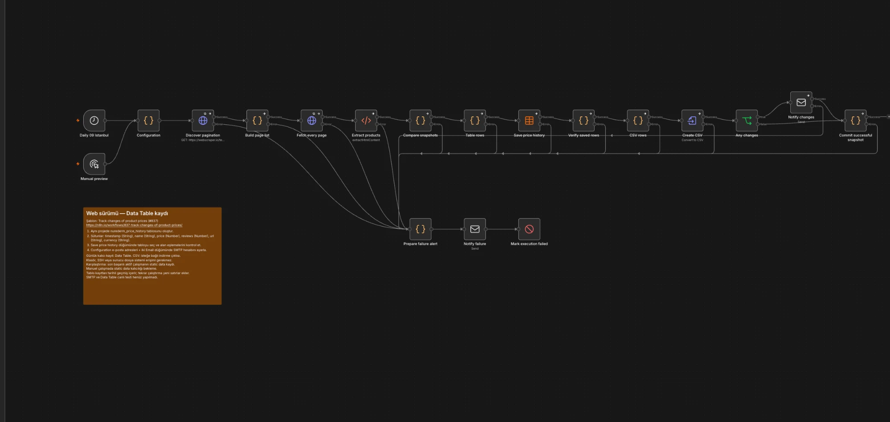

# Günlük laptop fiyat takibi

## Şablon ve değişiklikler

Başlangıç: **[Track changes of product prices — #837](https://n8n.io/workflows/837-track-changes-of-product-prices/)**, sthosstudio. Şablonun gerçek JSON'u `https://api.n8n.io/api/templates/workflows/837` üzerinden incelendi. Kaynak kaydı [template-source.json](template-source.json) içindedir.

Özgün şablondaki Cron, HTTP, HTML çıkarma, fiyat karşılaştırma, dosya ve e-posta rollerinden başlandı. Uyarlama bu rollerin yeni düğümlerle yeniden kurulmasıdır: Cron → Schedule; Function Item → Code; HTML Extract → HTML; Move Binary Data → Convert to File; Write Binary File → Data Table (ilk disk denemesi sonrasında). Şablondaki ürün başına izleme yerine tüm laptop kataloğu gezilir. Yalnızca daha iyi fiyat yerine yeni ürünler ve hem artış hem düşüş bildirilir. Shell komutları kaldırıldı.

## Adım adım

1. **Daily 09 Istanbul:** `0 9 * * *`, `Europe/Istanbul`. Manual preview sadece kurulum/tek çalışmalık kontrol içindir.
2. **Configuration:** çalışmanın ISO zaman damgası, gönderen ve alıcı.
3. **Discover pagination:** ilk sayfayı HTTPS üzerinden getirir. Zaman aşımı 20 saniye; en fazla 3 deneme.
4. **Build page list:** sayfalama alanındaki linklerden son sayfayı bulur, 1..N listesini üretir. Sayı 200'ü aşarsa veya alan yoksa hata verir. Bu test sitesi son sayfa linkini ilk sayfada gösterir; buna dayanır. Site farklı bir sayfalama tasarımına geçerse bu adım uyarlanmalıdır.
5. **Fetch every page:** her listedeki URL için HTTP isteği; tekli paket, 250 ms aralık. İlk sayfa da bu listede okunarak tek bir ürün çıkarma yolu kullanılır.
6. **Extract products:** `.thumbnail` içinde `a.title` öğesinin `title` ve `href` alanları; `[itemprop="price"]` ve `[itemprop="reviewCount"]` metinleri. Başlığın kırpılmamış attribute değeri alınır.
7. **Compare snapshots:** gelen sayfa sayısı planla eşleşmeli; her sayfa ürün içermeli ve dört alanın adetleri aynı olmalı. Fiyat `$` ve binlik ayıracından arındırılarak **number** yapılır; `$399` ve `$416.99` desteklenir. Yorum sayısı tam sayıya dönüşür. Linkler sabit izinli kökle birleştirilir; yinelenen ürün linki hata sayılır.
8. Ürünün kalıcı anahtarı linkidir. Son başarılı `staticData.previous` kaydıyla sent hassasiyetinde karşılaştırılır. İlk çalışmada hepsi yeni; aynı fiyatta bildirim yok; artış/düşüşte eski ve yeni fiyat gösterilir. Yorum değişikliği CSV'de kaydedilir, fiyat bildirimi üretmez. Kaldırılan ürün bildirimi bu görev kapsamında değildir.
9. **Table rows → Save price history → Verify saved rows:** her ürün `timestamp,name,price,reviews,url,currency` alanlarıyla Data Table'a eklenir. Insert çıktısındaki satır sayısı, URL benzersizliği, alanlar ve türler karşılaştırılır. Ardından **CSV rows → Create CSV** indirilebilir CSV üretir; metin alanlarında formül kaçışlaması uygulanır.
10. **Any changes → Notify changes:** değişiklik varsa tek düz metin e-posta; ürün ve eski/yeni fiyatlar listelenir. Değişiklik yoksa gönderim atlanır.
11. **Commit successful snapshot:** yalnızca tablo kaydı ve gerekiyorsa değişiklik bildirimi başarılı olduktan sonra önceki snapshot ve son başarı zamanı güncellenir. Bildirim/tablo hatasında eski snapshot korunur; sonraki çalışma değişikliği yeniden deneyebilir.

## Hata yolu

HTTP, sayfa keşfi, HTML çıkarma, doğrulama, tablo kaydı/doğrulama ve CSV oluşturma, değişiklik e-postası ve durum güncelleme düğümlerinin hata çıkışları **Prepare failure alert → Notify failure → Mark execution failed** yoluna bağlıdır.

- Site erişilemez, HTTP hata döner, herhangi bir sayfa boş olur veya veri eksikse hata bildirimi hazırlanır.
- Kısmi sayfalar gelirse toplam sayfa kontrolü başarı yolunu durdurur; eksik katalog önceki snapshot'ı bozmaz.
- Hata bildirimi sonrasında Stop And Error çalışır: süreç yeşil/başarılı olarak bitmez.
- SMTP de erişilemezse e-posta gönderilemez; Notify failure düğümü hatayla durur. E-posta altyapısı yokken bildirim ulaştırma garantisi yoktur. Üretimde n8n'in çalışma hataları ayrıca izlenmelidir.
- Bazı HTTP hatalarında başarılı ve hatalı öğeler ayrı çıkışlara ayrılabilir. Eksik sayfa kontrolü ikinci bir hata bildirimi üretebilir; bu güvenli tekrar kabul edilmiştir.

Tablo kayıtları bildirimden önce yazılır. Bildirim hatasında satırlar kalabilir, ancak karşılaştırma durumu ilerletilmez. Her çalışma yeni satırlar ekler; yeniden deneme yinelenen kayıt oluşturabilir. Tek seferlik teslim ve eşzamanlı yürütme garantisi verilmez.

## Kurulum

1. `workflow.json` dosyasını import edin; pasif gelir. `workflow-web.json` aynı teslimin alternatif adıdır. `workflow-local.json` eski disk varyantıdır.
2. Aynı n8n projesinde altı sütunlu `nurederm_price_history` tablosunu oluşturun: timestamp/name/url/currency String, price/reviews Number.
3. Save price history içinde tabloyu seçin, Map Automatically kullanın ve Optimize Bulk kapalı kalsın.
4. Configuration içinde gönderen/alıcıyı değiştirin; Notify changes ve Notify failure için SMTP credential seçin. Şifreyi JSON'a koymayın.
5. Gerçek alıcıya e-posta gönderebileceğini bilerek kurulum testini yapın. Ardından Europe/Istanbul ve `0 9 * * *` ayarlarıyla Publish yapın.

Ayrıntılı kurulum: [WEB-KURULUM.md](WEB-KURULUM.md).

`$getWorkflowStaticData` durumunun kalıcılığı aktif tetikleyici yürütmelerine bağlıdır; manuel yürütmeler arasında kalıcılık beklenmemelidir. Import sonrası ilk aktif çalışma başlangıç kataloğunu oluşturur. Workflow kimliği değiştirilir veya static data temizlenirse ürünler yeniden yeni sayılır. Bu tercih ek veritabanı hesabı gerektirmemek içindir; yüksek hacim/eşzamanlılıkta işlemsel bir veritabanı tercih edilmelidir.

## Kontrol kapsamı

`npm test`: import JSON içindeki Code kaynaklarını çalıştırır; düğüm bağlantıları, hata dalları, sayfalama, yeni/değişmeyen/değişen fiyat, bozuk veri ve snapshot commit davranışını kontrol eder. `npm run test:live`: gerçek HTML üzerinde aynı CSS seçicileri ve kodu dener. [Canlı kontrol sonucu](live-check.json): 20 sayfa, 117 ürün.

Yerel testler motor testinin yerine geçmez. Ayrıca kullanıcı ortamında Data Table, CSV, SMTP, iki zamanlanmış çalışma ve hata bildirimi doğrulandı: [CANLI-TESTLER.md](CANLI-TESTLER.md).

## Kaynaklar

- [Şablon #837](https://n8n.io/workflows/837-track-changes-of-product-prices/)
- [HTML node kaynak kodu](https://github.com/n8n-io/n8n/blob/master/packages/nodes-base/nodes/Html/Html.node.ts)
- [CSV node kaynak kodu](https://github.com/n8n-io/n8n/blob/master/packages/nodes-base/nodes/Files/ConvertToFile/actions/spreadsheet.operation.ts)
- [Dosya yazma node kaynak kodu](https://github.com/n8n-io/n8n/blob/master/packages/nodes-base/nodes/Files/ReadWriteFile/actions/write.operation.ts)
- [n8n dosya erişimi](https://docs.n8n.io/integrations/builtin/core-nodes/n8n-nodes-base.readwritefile/)
- [n8n tetikleyicilerde durum saklama](https://blog.n8n.io/creating-triggers-for-n8n-workflows-using-polling/)
- [Test sitesi](https://webscraper.io/test-sites/e-commerce/static/computers/laptops)

## Ekran görüntüsü

Canlı n8n (web) ortamında çalışan akış:

