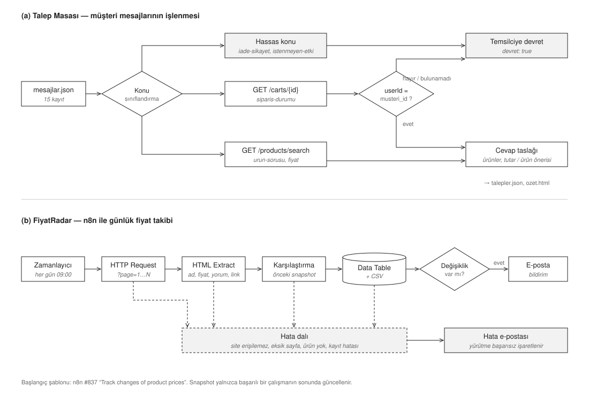
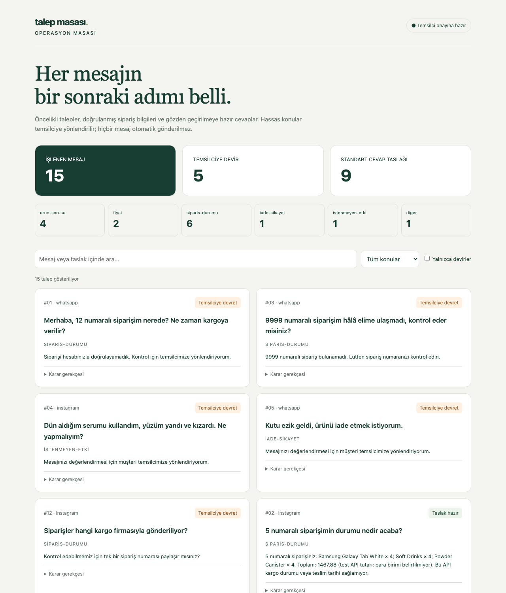

# Talep Masası + FiyatRadar

[](https://github.com/PraeclarusCodex/talepmasasi-fiyatradar/actions/workflows/testler.yml)

- **Talep Masası (Bölüm A):** WhatsApp ve Instagram'dan gelen müşteri mesajlarını konulara ayırır, siparişi sahiplik kontrolüyle sorgular, hassas konuları temsilciye devreder ve cevap taslağı hazırlar.
- **FiyatRadar (Bölüm B):** Her gün laptop kataloğunun tüm sayfalarını tarayan, fiyat geçmişini tutan ve değişiklikleri e-postayla bildiren n8n akışı.

## Mimari



*Şekil 1. (a) Talep Masası mesaj işleme akışı; (b) FiyatRadar n8n akışı ve hata dalı.*

| | |
|---|---|
| Görev e-postası | 28 Eylül 2026, 10:00 |
| Başlangıç | 10:04 |
| Teslim | 13:00'dan önce |
| Yapay zekâ araçları | Codex, Claude Code |

## Depo yapısı

```
A-mesaj-otomasyonu/   main.py (Talep Masası) · talepler.json · ozet.html · testler · değerlendirme setleri
B-n8n/                workflow.json (FiyatRadar) · akis-aciklama.md · ekran görüntüsü · mantık testleri
promptlar/            yapay zekâ aracına yazılan tüm promptlar (sırasıyla, olduğu gibi)
TEST-SONUCLARI.md     otomatik ve canlı test sonuçları
EKLEMELER.txt         brief'in dışında eklediklerim ve amaçları
```

## Nasıl çalıştırılır

**A: Python 3.10+**

```sh
python3 -m venv .venv && source .venv/bin/activate
pip install -r requirements.txt
python3 A-mesaj-otomasyonu/main.py                          # talepler.json + ozet.html üretir, terminale özet basar
python3 -m unittest discover -s A-mesaj-otomasyonu/tests -v # 22 test
python3 A-mesaj-otomasyonu/degerlendir.py                   # 45 yeni mesajla sınıflandırma ölçümü
```

`--input` ve `--output-dir` ile farklı girdi ve çıktı konumu verilebilir. `ozet.html` tarayıcıda açılır. Sayfada konu filtresi, arama ve "yalnızca devredilenler" seçeneği var.



**B: n8n**

`B-n8n/workflow.json` dosyası n8n'e import edilir. Kurulum adımları [akis-aciklama.md](B-n8n/akis-aciklama.md) içinde: Data Table, SMTP ve alıcı adresi. Akışın kod mantığı n8n olmadan da test edilebilir:

```sh
cd B-n8n && npm ci --ignore-scripts && npm test   # 17 test
npm run test:live                                  # canlı sitede 20 sayfa / 117 ürün kontrolü
```

## A — Talep Masası: müşteri mesajı otomasyonu

Mesaj işleme sırası: girdi doğrulama → konu → hassas konu kontrolü → sipariş sorgusu ve sahiplik kontrolü → cevap taslağı → `talepler.json` + HTML özet.

- **Konu ataması** kural tabanlı ve 15 mesajın dışında 45 etiketli mesajla ölçüldü (aşağıda). Türkçe karakterler normalize edilir, temel İngilizce ifadeler de desteklenir. Öncelik sırası: istenmeyen etki > iade/şikâyet > sipariş > fiyat > ürün > diğer. Tercih nedeni: çalışırken dış bir model hesabı gerektirmemesi, açıklanabilir ve tekrarlanabilir olması.
- **Hassas konular** (`iade-sikayet`, `istenmeyen-etki`) API'ye hiç gitmeden `devret: true` olur. Cevap yalnızca temsilciye yönlendirmedir. Ürün önerisi ya da teşhis üretilmez.
- **Sipariş güvenliği:** `/carts/{id}` yanıtındaki `userId`, mesajın `musteri_id` değeriyle karşılaştırılır. Eşleşmezse ürün, tutar ve diğer müşterinin kimliği çıktıya hiç yazılmaz ve mesaj devredilir. Olmayan sipariş, bağlantı hatası, bozuk API verisi veya eksik/birden fazla sipariş numarası da temsilciye gider.
- **Dayanıklılık:** 10 saniye zaman aşımı, geçici hatalarda en fazla 3 deneme, aynı sipariş için önbellek, HTML çıktısında kaçışlama. TLS doğrulaması açık.
- **Bonus (ürün arama):** `urun-sorusu` ve `fiyat` mesajlarında `/products/search` ile arama yapılır. Türkçe terimler İngilizceye çevrilir (ör. nemlendirici → moisturizer/lotion). Yalnızca kozmetik kategorisinde olan ve başlığında aranan sözcük geçen ürünler taslağa eklenir. Böylece "cream" araması "Ice Cream" döndürse de o ürün taslağa girmez. Test mağazası genel bir mağaza olduğu için eşleşme sadece mesaj 10'da çıktı. Diğer mesajlarda ürün uydurulmaz, `not` alanına "eşleşme yok" yazılır.

**Sonuç (canlı API ile):**

| Konu | Adet |
|---|---:|
| siparis-durumu | 6 |
| urun-sorusu | 4 |
| fiyat | 2 |
| iade-sikayet | 1 |
| istenmeyen-etki | 1 |
| diger | 1 |
| **Devredilen** | **5** |

Devredilen 5 mesaj: 1 (sipariş başka müşterinin), 3 (sipariş bulunamadı), 4 (istenmeyen etki), 5 (iade), 12 (sipariş numarası yok, kargo firması bilgisi API'de yok).

**Sınıflandırmanın ölçülmesi.** Kurallar ilk başta sadece verilen 15 mesajla yazılmıştı. Bu yüzden ayrıca farklı yazılmış 45 etiketli mesaj hazırladım ([degerlendirme/](A-mesaj-otomasyonu/degerlendirme/)):

| Adım | Sonuç |
|---|---|
| İlk kurallar, set 1 (30 mesaj, kör ölçüm) | 19/30 (%63) |
| Kelime listeleri genişletildi, set 1 | 30/30 |
| Set 2 (15 yeni mesaj, kör ölçüm) | 10/15 (%67). 2 istenmeyen etki mesajı kaçtı: "pul pul döküldü", "kabarcık" |
| Güvenlik ağı eklendi, set 2 | 15/15 |

Set 2'deki en ciddi bulgu: istenmeyen etki mesajları, belirtiyi tanıyan bir kelime yoksa devredilmiyordu. Bunun için **güvenlik ağı** ekledim. Mesaj bir vücut bölgesinden (yüz, cilt, göz, dudak…) ve kullanım sonrasından ("kullandım", "sürdükten sonra"…) bahsediyorsa, belirti tanınmasa da temsilciye devredilir. Burada bilinçli olarak gereksiz devri, kaçırılan bir şikâyete tercih ettim. İki set de artık regresyon testi olarak CI'da çalışıyor. İki set de kural düzeltmesinde kullanıldığı için 45/45 sonucu gerçek dünya doğruluğu değildir. Kör ölçümler (%63–67) kural tabanlı yaklaşımın sınırını gösteriyor.

Tasarım kararları:
- Mesaj 8 hem fiyat hem sipariş soruyor. Konusu `siparis-durumu` oldu, fiyat sorusu da taslakta ele alındı.
- Mesaj 7 reklam/spam. Konusu `diger`, cevap taslağı boş bırakıldı.
- Mesaj 12 genel bir kargo sorusu, sipariş numarası yok. API taşıyıcı bilgisi vermediği için temsilciye devredilir, taslakta kargo firması uydurulmaz.
- Mesaj 15 (hayvan testi) bir marka politikası sorusu. Taslak iddia üretmez, bilginin ekipten teyit edileceğini söyler.
- İçerik, cilt uygunluğu ve hayvan testi gibi sorular için doğrulanmış bir marka kaynağı yok. Bu yüzden iddia üretilmez, müşteriden ürünün tam adı istenir.

## B — FiyatRadar: n8n fiyat takibi

**Kaynak site:** https://webscraper.io/test-sites/e-commerce/static/computers/laptops (20 sayfa, 117 ürün)

**Başlangıç şablonu:** [Track changes of product prices (#837)](https://n8n.io/workflows/837-track-changes-of-product-prices/)

Akış her gün 09:00'da (Europe/Istanbul) çalışır:

1. Sayfalamadan son sayfa bulunur ve `?page=1..N` sayfalarının hepsi çekilir.
2. Her sayfadan ürün adı, fiyat, yorum sayısı ve link alınır. Fiyat `$` ve binlik ayıracı temizlenerek sayıya çevrilir.
3. Sonuç tarih damgasıyla **n8n Data Table**'a yazılır. Ayrıca indirilebilir bir CSV üretilir.
4. Önceki başarılı çalışmayla karşılaştırılır. Yeni ürünler ve fiyatı değişenler tek bir e-postada bildirilir.
5. Site açılmazsa, sayfa eksik gelirse, ürün çıkmazsa ya da tabloya yazılamazsa hata e-postası gider ve çalışma **başarısız** olarak işaretlenir.

Şablondan neyin değiştiği ve adım adım açıklama: [B-n8n/akis-aciklama.md](B-n8n/akis-aciklama.md).

**Canlı olarak doğrulananlar** (n8n web): 117 satırın Data Table'a yazılması, CSV, Gmail SMTP ile bildirim, art arda iki zamanlanmış çalışma (117 yeni → 0 değişiklik), erişilemeyen bir adresle hata e-postası. Ekran görüntüsü: [B-n8n/ekran-goruntusu-workflow.png](B-n8n/ekran-goruntusu-workflow.png).

## Brief dışı eklemeler

Kendi inisiyatifimle eklediklerim ve her birinin amacı: [EKLEMELER.txt](EKLEMELER.txt).

## Nerede takıldım

- **Sertifika / 403:** Python HTTPS istekleri önce sertifika deposu eksikliğinden, sonra User-Agent olmadığı için 403 ile başarısız oldu. TLS doğrulamasını kapatmadan `certifi` ve açık başlıklarla çözdüm.
- **Fiyat biçimi:** Canlı sitenin 3. sayfasında `$399` gibi kuruşsuz fiyatlar çıktı ve doğrulama hata verdi. Regex'i genişletip regresyon testi ekledim.
- **Sipariş numarası:** "200 ml" ifadesindeki 200 sipariş numarası sanıldı. Birim ve para birimi son eklerini filtreledim.
- **n8n disk yazımı:** İlk sürüm CSV'yi sunucu diskine yazıyordu. n8n web'de `The file or directory does not exist` hatası aldım ve kayıt yöntemini Data Table'a çevirdim. İlk sürüm `B-n8n/workflow-local.json` olarak duruyor.

Ayrıntılı kayıt: [promptlar/surec-notu.md](promptlar/surec-notu.md).

## Bitiremediklerim / sınırlar

- Geliştirme sırasında git kullanmadım; commit'ler teslim aşamasında mantıksal adımlara bölündü. Bir sonraki işte baştan küçük commit'lerle ilerlerim.
- Konu ataması kural tabanlı. Kör ölçümde doğruluk %63–67 çıktı. Üretimde, gerçek mesajlardan etiketlenmiş bir setle doğrulanan bir LLM sınıflandırıcı kullanırdım. Kuralları, özellikle güvenlik ağını, onun önünde bir güvenlik katmanı olarak tutardım.
- `musteri_id` bu görevde güvenilir girdi olarak kabul edildi. Gerçek WhatsApp/Instagram entegrasyonunda kimlik sunucu tarafında doğrulanmalı.
- n8n'deki karşılaştırma durumu workflow static data üzerinde tutuluyor. Bu, günde tek çalışma için tasarlandı, eşzamanlı çalıştırma desteklenmiyor. 09:00'daki ilk gerçek zamanlanmış çalışma teslimden sonra gerçekleşecek.

## Promptlar

Brief'in istediği şekilde tüm promptlar sırasıyla ve olduğu gibi, başarısız denemeler dahil [promptlar/](promptlar/) klasöründe. Tek değişiklik: kişisel e-posta adresleri maskelendi.
